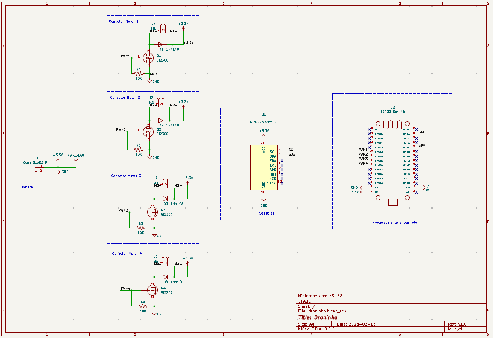
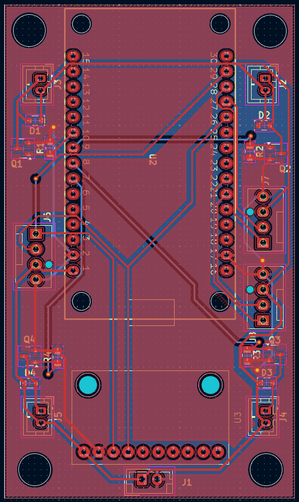

# Droninho

Este repositório apresenta um diagrama eletrônico esquemático feito em KiCad 9.0 de um drone pequeno baseado em ESP32. O objetivo é produzir a placa de circuito impresso do hardware do droninho.

---

## Objetivo

- Produzir a placa de circuito impresso do hardware do droninho.

---

## To-Do

- [x] ERC OKAY!
- [ ] Checar footprint do conectores *J1, J2, J3, J4*.
- [ ] Criar PCB.

---
 
## Esquemático

{ height="200px" }

---

## PCB

{ height="200px" }

---

## 3D model

{ height="200px" }

---

## Estrutura do Repositório

- `droninho.kicad_pcb`: Arquivo da placa de circuito impresso.
- `droninho.kicad_prl`: Arquivo de projeto.
- `droninho.kicad_pro`: Arquivo de projeto.
- `droninho.kicad_sch`: Arquivo esquemático.
- `esquematico.png`: Imagem do diagrama esquemático.
- `Documentation/`: Pasta contendo documentos adicionais.
  - `etapa_potencia.jpeg`: Imagem da etapa de potência.
  - `si2300ds.pdf`: Datasheet do componente SI2300.
  - `useful-links.txt`: Links úteis relacionados ao projeto.
- `droninho-backups/`: Pasta contendo backups do projeto.

---

## Como Contribuir

1. Faça um fork deste repositório.
2. Crie uma branch para sua feature (`git checkout -b feature/nome-da-feature`).
3. Faça commit das suas alterações (`git commit -m 'Adiciona nova feature'`).
4. Faça push para a branch (`git push origin feature/nome-da-feature`).
5. Abra um Pull Request.

---

## Licença

Este projeto está licenciado sob a licença MIT.