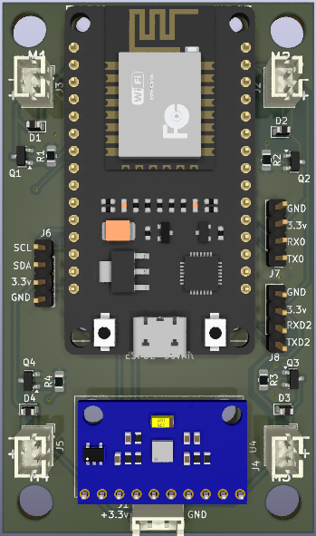

# Droninho

Este repositório apresenta um diagrama eletrônico esquemático feito em KiCad 9.0 de um drone pequeno baseado em ESP32. O objetivo é produzir a placa de circuito impresso do hardware do droninho.

---

## Objetivo

- Produzir a placa de circuito impresso do hardware do droninho.

---

## To-Do

- [x] ERC OKAY!
- [ ] Checar footprint do conectores *J1, J2, J3, J4*.
- [x] Criar PCB.
- [ ] Checar PCB rules.

---
 
## Esquemático

---

## PCB

---

## 3D model

---

## Como Contribuir

1. Faça um fork deste repositório.
2. Crie uma branch para sua feature (`git checkout -b feature/nome-da-feature`).
3. Faça commit das suas alterações (`git commit -m 'Adiciona nova feature'`).
4. Faça push para a branch (`git push origin feature/nome-da-feature`).
5. Abra um Pull Request.

---

## Licença

Este projeto está licenciado sob a licença MIT.