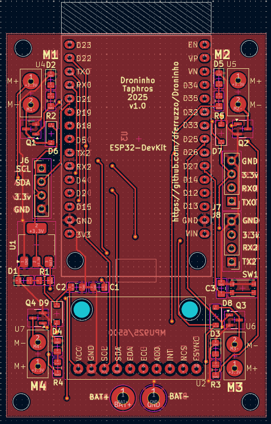
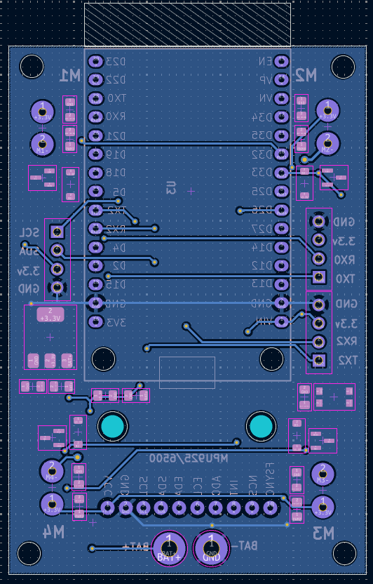
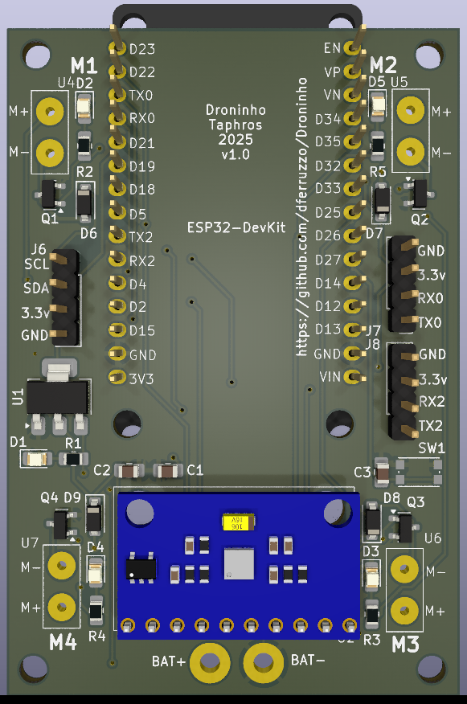
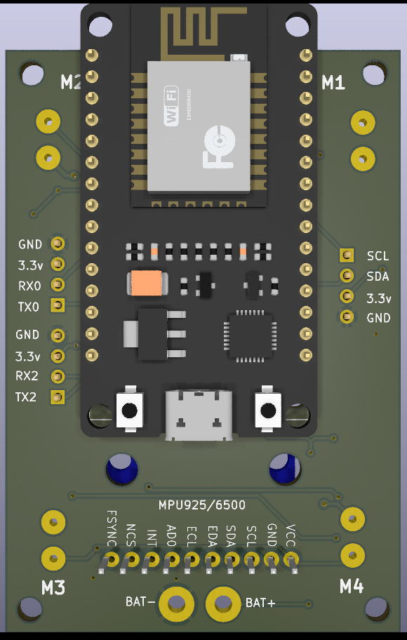

# Droninho

Este repositório apresenta um diagrama eletrônico esquemático feito em [KiCad 9.0](https://www.kicad.org/) de um drone pequeno baseado em ESP32. 

---

## Objetivo

- Produzir a placa de circuito impresso do hardware do droninho.

---

## To-Do

- [x] ERC OKAY!
- [x] Criar PCB.
- [x] Checar footprint do conectores *J2, J3, J4, J5*.
- [x] Checar footprint do conector da bateria *J1*.
- [x] Checar PCB rules. Corrigir footprint do MPU9250.
- [x] Add connector for I2C and Power to connect other components for testing
- [x] Consider connection for RC receiver (cancelled!).
- [x] O MPU9250 está muito perto do ESP32 na placa.
- [x] Adicionar layer com nomes dos componentes e conectores. 
- [x] For review.
- [x] Duvida: A distancia entre a entrada USB do ESP32 e o MPU9250 é suficiente? Não.
- [x] Mudar de lado o ESP32 OK.
- [x] Mudar footprint dos diodos e resistências OK.
- [x] Colocar uma fonte regulada de 3.3v. https://docs.espressif.com/projects/esp-dev-kits/en/latest/esp32/esp32-devkitc/user_guide.html#power-supply-options https://dl.espressif.com/dl/schematics/esp32_devkitc_v4_sch.pdf
- [x] Mudar os footprints dos conectores dos motores e da bateria (só da bateria).
- [ ] Mandar a produzir com PCBway.

---
 
## Esquemático

[Diagrama elétrico esquemático.](schematics.pdf)

---

## PCB

PCB Front

PCB Back

---

## 3D model

---

## Como Contribuir

1. Faça um fork deste repositório.
2. Crie uma branch para sua feature (`git checkout -b feature/nome-da-feature`).
3. Faça commit das suas alterações (`git commit -m 'Adiciona nova feature'`).
4. Faça push para a branch (`git push origin feature/nome-da-feature`).
5. Abra um Pull Request.

---

## Licença

Este projeto está licenciado sob a licença MIT.